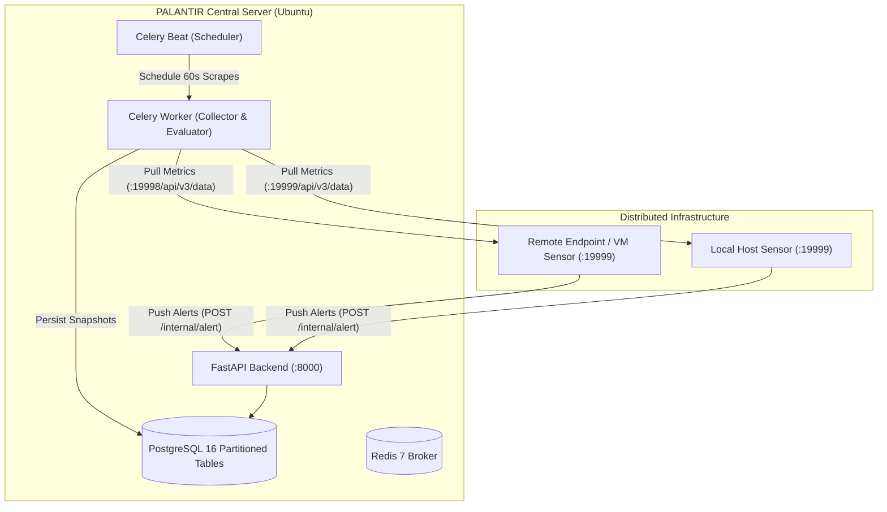

# PALANTIR — Netdata Autonomous Monitoring & Investigation Platform

PALANTIR integrates high-resolution per-second telemetry from Netdata Agent sensors across distributed nodes, evaluates machine learning anomaly rates, ingests real-time alert webhooks, and orchestrates autonomous security investigations.

---

## Architecture Overview



- **Backend**: FastAPI (`/api/v1/*` for UI & management, `/internal/alert` for HMAC-authenticated push webhooks).
- **Background Workers**: Celery with Redis broker (60s metric collection across all active nodes, 5m ML anomaly evaluation, 24h retention pruning).
- **Database**: PostgreSQL 16 with time-range partitioned metric storage and relational event logs.
- **Sensor**: Lightweight, containerized Netdata Agent v2.11.1 probes (`abdullahahmadfarooqi/palantir-netdata:latest`, 61.7MB).

---

## 1. Quickstart: Central Server (Ubuntu)

Run the central PALANTIR platform on your primary server:

```bash
# 1. Clone repository and set up environment
git clone https://github.com/abdullah-farooqi/PALANTIR.git
cd PALANTIR
cp .env.example .env

# 2. Launch the full stack
docker compose up -d

# 3. Verify health
curl -s http://localhost:8000/healthz | python3 -m json.tool
```

On boot, the backend automatically discovers the local Netdata sensor, maps 260+ telemetry contexts, and registers `local-node` into PostgreSQL.

---

## 2. Deploying on Remote Endpoints / VMs (Zero-Touch)

You do **not** need PostgreSQL, Redis, Celery, or the full codebase on remote nodes. Simply run the published lightweight Netdata sensor image from Docker Hub.

### Method A: One-Line Docker Run
On the remote machine (e.g. Kali Linux, Ubuntu, Debian, CentOS):

```bash
docker run -d \
  --name palantir-agent \
  --restart unless-stopped \
  --pid host \
  --cap-add SYS_PTRACE \
  --cap-add SYS_ADMIN \
  --security-opt apparmor:unconfined \
  -p 19999:19999 \
  -e PALANTIR_WEBHOOK_URL=http://<SYSADMIN_SERVER_IP>:8000/internal/alert \
  -e PALANTIR_WEBHOOK_SECRET=palantir-super-secret-key-change-me \
  abdullahahmadfarooqi/palantir-netdata:latest
```

Then register the remote node with the central server:

```bash
curl -X POST http://<SYSADMIN_SERVER_IP>:8000/api/v1/nodes \
  -H "Content-Type: application/json" \
  -d '{"hostname":"<REMOTE_HOSTNAME>","netdata_url":"http://<REMOTE_IP>:19999","os_type":"linux"}'
```

---

### Method B: Automated Installer Script
Use the built-in automated enrollment script:

```bash
./scripts/install-agent.sh http://<SYSADMIN_SERVER_IP>:8000
```

---

## 3. VirtualBox / NAT VM Networking Guide

If deploying the remote agent inside a virtual machine (e.g., VirtualBox with default NAT IP `10.0.2.15`), the host cannot route inbound traffic into `10.0.2.15:19999` directly. Choose one of two options:

### Option 1: Bridged Networking (Recommended for LAN)
1. In VirtualBox: VM **Settings** -> **Network** -> **Adapter 1** -> Change **NAT** to **Bridged Adapter**.
2. Inside the VM: renew IP (`sudo dhclient -v`). The VM receives a LAN IP (e.g., `192.168.18.X`), directly reachable by the host.

### Option 2: Live Port Forwarding (While Keeping NAT)
From the host machine, forward host port `19998` to guest port `19999` without restarting the VM:

```bash
VBoxManage controlvm "<VM_NAME>" natpf1 "netdata-agent,tcp,,19998,,19999"
```

Then register the node pointing to the host's forwarded port:
```bash
curl -X POST http://<SYSADMIN_SERVER_IP>:8000/api/v1/nodes \
  -H "Content-Type: application/json" \
  -d '{"hostname":"<VM_NAME>","netdata_url":"http://<SYSADMIN_SERVER_IP>:19998","os_type":"linux"}'
```

---

## 4. Verification & Testing

### Verify Live Ingestion on Central Server (Ubuntu)
```bash
# 1. Watch incoming snapshot count update every 60s
watch -n 5 "docker exec palantir-postgres psql -U palantir -d palantir -c \
  'SELECT category, count(*), max(collected_at) AS latest_stream FROM metric_snapshots GROUP BY category;'"

# 2. Query live real-time metrics for a specific node (e.g. node 5)
curl -s http://localhost:8000/api/v1/nodes/5/metrics | python3 -m json.tool

# 3. Stream clean Celery worker collection logs
docker logs -f --tail 20 palantir-celery-worker 2>&1 | grep --line-buffered "19998"
```

### Run the Automated Test Suite (32 Tests)
```bash
docker exec palantir-backend pytest -v
```
All 32 tests validate API contracts, Netdata JSON2 parsers, NaN/Inf resilience, timing-safe webhook HMAC verification, and Celery pipelines.

---

## 5. Branching & Contribution Strategy

The PALANTIR development workflow follows a phased branch hierarchy:
1. `telemetry_pipeline` (Feature branch): Active development of sensor collection, parsers, and node enrollment.
2. `initial_project` (Integration branch): Staging branch for reviewing and integrating complete functional milestones.
3. `main` (Production branch): Protected branch for stable, mature application releases.
