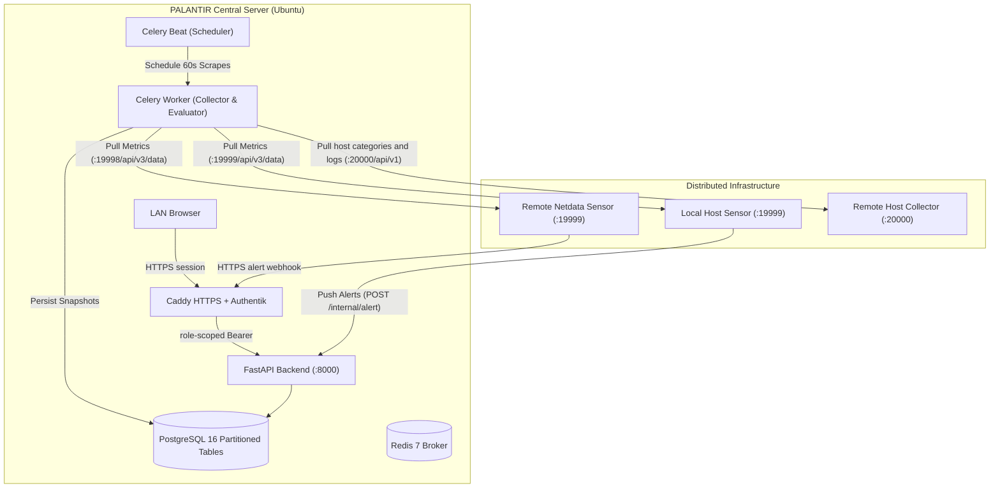

# PALANTIR — Netdata Autonomous Monitoring & Investigation Platform

PALANTIR polls Linux Netdata sensors and a companion host collector every 60 seconds, stores typed telemetry and structured log events, evaluates machine learning anomaly rates, and receives alert webhooks.

---

## Architecture Overview



- **LAN gateway**: Caddy terminates private HTTPS and uses Authentik forward authentication to assign read, admin, or enrollment access.
- **Backend**: FastAPI (`/api/v1/*` for role-authenticated UI & management APIs, `/internal/alert` for shared-secret-authenticated push webhooks).
- **Background Workers**: Celery with Redis broker (60s metric collection across active nodes, 5m ML anomaly evaluation, configurable metric and log retention).
- **Database**: PostgreSQL 16 with time-range partitioned metric storage and relational event logs.
- **Remote agent bundle**: Netdata Agent v2.11.1 plus the PALANTIR Linux host collector, deployed together through Docker Compose.

---

## 1. Quickstart: Central Server (Ubuntu)

Run the central PALANTIR platform on your primary server:

```bash
# 1. Clone repository and set up environment
git clone https://github.com/abdullah-farooqi/PALANTIR.git
cd PALANTIR
cp .env.example .env

# Generate independent values, then paste each into its matching .env setting:
openssl rand -hex 32  # run separately for each database password, API token, and webhook secret
openssl rand -base64 48  # AUTHENTIK_SECRET_KEY
# Set PALANTIR_LAN_BIND_IP to the server's static LAN address before starting.

# 2. Launch the full stack
docker compose up -d --build

# 3. Verify health
curl -s http://localhost:8000/healthz | python3 -m json.tool
```

### Test the published images on another machine

GitHub Actions publishes the backend, Netdata, and host collector images to
Docker Hub and GitHub Container Registry after the unit and Docker smoke tests
pass. The central stack uses Docker Hub images by default. To pull those images
on a test machine, clone this repository for its Compose files and SQL schema,
then prepare a private environment file:

```bash
git clone https://github.com/abdullah-farooqi/PALANTIR.git
cd PALANTIR
cp .env.example .env
chmod 600 .env
```

Set the required database passwords, webhook secret, API tokens, and Authentik
secret in `.env`. Generate a separate value for each with `openssl rand -hex
32`. Set `PALANTIR_LAN_BIND_IP` to the test machine's LAN address if other
machines need to reach it. Keep `.env` on that machine and out of GitHub.

To use the published images rather than rebuilding or mounting source code,
run:

```bash
docker compose -f docker-compose.yml -f docker-compose.images.yml pull
docker compose -f docker-compose.yml -f docker-compose.images.yml up -d --no-build
```

Docker Hub images can be pulled without logging in when their repositories are
public. For private repositories, run `docker login` with a Docker Hub access
token. The GitHub Actions publish job uses the repository's `DOCKERHUB_TOKEN`
secret for Docker Hub and its built-in `GITHUB_TOKEN` for GitHub Container
Registry. These registry credentials are separate from the runtime values in
`.env`.

On boot, the backend probes the configured Netdata endpoint, discovers the contexts available on that host, and registers `local-node` into PostgreSQL. Context counts are host-specific and must not be hard-coded.

### API access

All `/api/v1` routes require a Bearer token. Read tokens can call read routes;
admin tokens can also deactivate nodes and request investigations. The optional
enrollment token can create a node or repeat an identical enrollment, but cannot
modify or reactivate one. Tokens are distinct, random values of at least 32
characters and stay in the server `.env`. Caddy removes browser-supplied
authorization and identity headers, then injects a role-scoped token after
Authentik authenticates the session. The only caller-supplied token accepted at
the proxy is the restricted enrollment token, and only for `POST /api/v1/nodes`;
the backend further limits it to create-only registration. The backend listens
on host loopback, so LAN clients use the proxy. Never put shared tokens in
browser JavaScript.

### LAN proxy and Authentik setup

The included Caddy and Authentik services use `palantir.home.arpa` and
`auth.palantir.home.arpa`. Add both names to the LAN DNS server (or each client’s
hosts file), pointing them to the central server’s static LAN IP. Keep Caddy
bound to that LAN interface and allow ports 80/443 only from the LAN. The
`home.arpa` suffix is reserved for residential home networks; it is not a public
DNS name.

Before starting Compose, set `POSTGRES_PASSWORD`, `PALANTIR_LAN_BIND_IP`,
`PALANTIR_API_READ_TOKEN`, `PALANTIR_API_ADMIN_TOKEN`,
`PALANTIR_WEBHOOK_SECRET`, `AUTHENTIK_SECRET_KEY`, and
`AUTHENTIK_POSTGRES_PASSWORD` in `.env`. Generate a different random value of
at least 32 characters for each secret/token (for example, run
`openssl rand -hex 32` separately for each). Keep all values distinct. Without
a webhook secret, alert webhooks are rejected; without API tokens, API requests
fail closed. Add both DNS names to the LAN DNS server before clients use them.
Start the stack with `docker compose up -d`.

Make an initial TLS request from the server so Caddy creates its local root CA:

```bash
openssl s_client -connect <PALANTIR_LAN_IP>:443 -servername palantir.home.arpa </dev/null
```

Export the certificate and install it on each client as described below. Then
open `https://auth.palantir.home.arpa/if/flow/initial-setup/` (keep the trailing
slash) and complete Authentik's initial admin setup.
Create these Authentik groups using the exact names:

- `palantir-read` for UI/API read access.
- `palantir-admin` for read and management access.
- `palantir-enroll` for create-only node registration; this group also requires
  `PALANTIR_API_ENROLL_TOKEN` in `.env`.

Create user accounts and add each account to the group matching its access level.

Create a Proxy Provider in **Forward auth (single application)** mode with
external host `https://palantir.home.arpa`, create its Application, and assign
the `palantir-read`, `palantir-admin`, and (if enabled) `palantir-enroll` groups
to that application with group policy bindings. Add the application to
Authentik's embedded outpost under **Applications → Outposts**. Caddy routes the
outpost callback and maps these group names to the matching server-side API
token. Read users can only read; admin users can read and use management
routes; enrollment users can only POST to `/api/v1/nodes`.

For LAN HTTPS, Caddy creates a private local certificate authority. Export its
root certificate from `palantir-caddy`:

```bash
docker cp palantir-caddy:/data/caddy/pki/authorities/local/root.crt ./caddy-root.crt
```

Install it as trusted on each client before opening either site. On Debian or
Ubuntu clients:

```bash
sudo install -m 0644 caddy-root.crt /usr/local/share/ca-certificates/palantir-caddy.crt
sudo update-ca-certificates
```

The Caddy root CA is stored in the persistent `caddy_data` volume. Copy only its
public root certificate to clients. For agents installed with
`scripts/install-agent.sh`, first copy that file to the remote host, then pass
`--ca-cert /path/to/caddy-root.crt`; the installer configures both the node
enroller and Netdata webhook client to trust it. The root file
`central-ca.crt` is only a placeholder for manual `docker-compose.agent.yml`
deployments. Caddy's local certificates do not need public DNS or external port
access.

This proxy setup expects the React UI to use the same origin as the API, so
leave `CORS_ALLOWED_ORIGINS` empty. Cross-origin browser access needs a separate
session and credential design; setting an origin alone is insufficient while
CORS credentials remain disabled.

---

## 2. Deploying on Remote Endpoints / VMs (Zero-Touch)

Remote hosts do **not** run PostgreSQL, Redis, Celery, or the central backend. Deploy the Netdata sensor and PALANTIR host collector together with Compose. The Compose enroller registers both endpoints.

### One-command endpoint installation

On a Linux endpoint that already has Docker and Docker Compose, run this once
as root. Copy `caddy-root.crt` from the PALANTIR server to the endpoint first:

```bash
curl -fsSL https://raw.githubusercontent.com/abdullah-farooqi/PALANTIR/telemetry_pipeline/scripts/install-agent.sh \
  | sudo bash -s -- --server https://palantir.home.arpa --ca-cert /path/to/caddy-root.crt --secret '<CENTRAL_PALANTIR_WEBHOOK_SECRET>' --enrollment-token '<CENTRAL_PALANTIR_API_ENROLL_TOKEN>'
```

The installer detects the hostname and reachable host IP, downloads the Compose
definition, writes its protected configuration under `/opt/palantir-agent`,
pulls the Netdata and PALANTIR images, starts the bundle, waits for health, and
enrolls the node centrally using the optional restricted enrollment token. The
token can create new nodes and repeat an unchanged enrollment; it cannot read
data, modify existing nodes, or deactivate them. The
central server URL, webhook secret, and enrollment token are configured for the
agent. The enrollment token is accepted only for node-registration POSTs and is
checked by the backend's create-only role. Without it, the agent skips automatic
registration; register the endpoint later from the central host with
`scripts/register-node.sh` and an admin token. Optional flags can override the
hostname, IP, ports, image tags, install directory, or collector token. Docker
and Compose must already be installed on the endpoint.

The bundle exposes Netdata on port `19999` and the host collector on `20000`. Allow central-server access to those ports on the private network. The collector mounts host `/proc`, `/sys`, `/var/log`, `/run`, and `/` read-only so it can inspect mount usage and host files. That grants it read access to host files; the mounted Docker socket can also issue Docker API operations even through a read-only filesystem mount. Restrict network access to the agent ports and deploy it only on trusted hosts.

The webhook secret must match `PALANTIR_WEBHOOK_SECRET` on the central server. The installer requires it through `--secret` or the `PALANTIR_WEBHOOK_SECRET` environment variable.

Optional collector authentication uses the same token in the central `.env` (`AGENT_AUTH_TOKEN`) and the remote agent (`--token` or `PALANTIR_AGENT_TOKEN`). Without a token, any client that can reach port `20000` can query the collector.

Optional host integrations are discovered and skipped when unavailable. Docker and LXD use their local sockets; libvirt uses the host system connection. Kubernetes and Proxmox API integrations can be configured with `KUBERNETES_API_URL`, `KUBERNETES_TOKEN`, `KUBERNETES_CA_CERT`, `PROXMOX_API_URL`, `PROXMOX_API_TOKEN`, and `PROXMOX_CA_CERT` in the agent Compose environment. Proxmox tokens use the API token value expected by its `PVEAPIToken` authorization scheme. Direct containerd CRI and legacy LXC collection are reported as not configured. Application log paths are configurable with `APP_LOG_GLOBS`; the collector starts tailing files from their current end and parses new JSON, syslog, or plain-text lines into events. It includes debug-level records by default; set `LOG_MIN_PRIORITY=6` to omit debug events.

Build and publish the new collector image along with the existing images before remote deployment:

```bash
./scripts/build-and-push.sh --hub <DOCKERHUB_USER> --tag <VERSION>
```

### Existing single-container installations

The old `docker run` command deploys only Netdata. Replace it with the Compose bundle to enable host collection. Legacy nodes registered with only `netdata_url` continue to be polled for their existing Netdata categories.

For a locally checked-out copy of this repository, run the same installer as
root with `--server` and `--secret`; it performs the deployment and enrollment
without requiring manual Compose or `.env` editing.

---

## 3. VirtualBox / NAT VM Networking Guide

If deploying the remote agent inside a virtual machine (e.g., VirtualBox with default NAT IP `10.0.2.15`), the host cannot route inbound traffic into `10.0.2.15:19999` directly. Choose one of two options:

### Option 1: Bridged Networking (Recommended for LAN)
1. In VirtualBox: VM **Settings** -> **Network** -> **Adapter 1** -> Change **NAT** to **Bridged Adapter**.
2. Inside the VM: renew IP (`sudo dhclient -v`). The VM receives a LAN IP (e.g., `192.168.18.X`), directly reachable by the host.

### Option 2: Live Port Forwarding (While Keeping NAT)
From the host machine, forward host port `19998` to guest port `19999` without restarting the VM:

```bash
VBoxManage controlvm "<VM_NAME>" natpf1 "netdata-agent,tcp,,19998,,19999"
```

Then register the node in the PALANTIR UI while signed in as a member of the
`palantir-admin` group. The proxy intentionally drops browser-supplied Bearer
headers and chooses the token from the Authentik session instead.

---

## 4. Backend telemetry APIs and retention

The authenticated read API provides these telemetry contracts:

- `GET /api/v1/fleet/summary` returns total/enabled/disabled nodes, enabled-node
  reachability counts, the latest metric timestamp, currently active alerts,
  anomalies from the previous 24 hours, and API/database plus collection and
  anomaly-task health. A worker heartbeat reports task execution and partial
  node-level failures; it does not guarantee that every node/category scrape succeeded.
- `GET /api/v1/events` returns a fleet-wide alert/anomaly feed. Filters are
  `event_type=alert|anomaly|all`, `node_id`, alert `severity`, anomaly
  `min_score`, `since`, and `until`. `limit` is 1–500; `cursor` is an opaque
  keyset cursor. Follow it with the same filters. Responses contain `items`,
  `has_more`, and `next_cursor`.
- `GET /api/v1/nodes/{node_id}` and the node list include `last_seen_at`,
  `last_collection_at`, and derived `reachability`. Defaults are reachable at
  180 seconds since contact and stale at 900 seconds; `active` continues to
  mean administratively enabled. Configure with `NODE_REACHABLE_SECONDS` and
  `NODE_STALE_SECONDS`.
- `GET /api/v1/nodes/{node_id}/collection-status` reports eight categories
  (`system`, `storage`, `network`, `services`, `processes`, `connections`,
  `containers`, `vms`) for Netdata and the optional PALANTIR agent. Statuses
  include `available`, `not_configured`, `unsupported`, `collection_error`,
  `unknown`, and derived `stale`; each source includes last attempt/success and
  safe error information. Category freshness defaults to 180 seconds and is
  configurable with `METRIC_STALE_SECONDS`.
- `GET /api/v1/nodes/{node_id}/metrics/{category}/series` accepts timezone-aware
  `since`/`until`, optional `source`, `limit` (1–1,000), and opaque `cursor`.
  Optional `bucket_seconds` (10–86,400) returns source-grouped server-side
  average/minimum/maximum values for typed numeric fields and sample counts.
  Requested windows cannot predate or exceed `METRICS_RETENTION_HOURS`; each
  response returns the requested window, retention cutoff, aggregation, and
  paging state. Use the cursor with unchanged filters.
- `GET /api/v1/metrics/schema` returns schema version 1, the common snapshot
  envelope, category/source support, and typed metric names, types, units, and
  labels. Additional raw JSON keys are collector-defined and may be absent.

The legacy `/api/v1/nodes/{node_id}/metrics/{category}` history route remains
available with a 100-snapshot cap. `/api/v1/nodes/{node_id}/capabilities`
reports host-collector capabilities. Structured log events are available from
`/api/v1/nodes/{node_id}/logs` with `since`, `until`, `severity`, `source`,
`limit`, and `offset` filters. Alert active state is derived from the latest
transition by node, alert name, and chart.

Additional Priority 2/3 APIs are:

- `GET /api/v1/logs` searches messages across the fleet with full-text `q`,
  `node_id`, `service`, `pid`, `source`, `severity`, `since`, and `until`
  filters. `limit` is 1–500 and pages use a stable `cursor`, `has_more`, and
  `next_cursor` contract.
- `POST /api/v1/investigations` (admin) queues a manual investigation or one
  tied to an alert/anomaly owned by the requested node. It returns HTTP 202
  after Redis/Celery accepts the job. WARNING/CRITICAL alerts and qualifying
  anomaly events enqueue investigations automatically. Dispatch failures are
  persisted and return HTTP 503 with the failed investigation ID.
- Investigation records expose `job_id`, `queued_at`, `started_at`,
  `completed_at`, `progress`, `queue_delay_ms`, terminal status, and safe
  failure details. `GET /api/v1/investigations/search` filters by node, status,
  trigger type, and time range with stable cursor paging. Result schema version
  1 enforces a strict bounded contract for metric, alert, anomaly, and trigger
  evidence before persistence. It does not infer a root cause.
- `GET /api/v1/nodes/search` provides hostname search, enabled/OS/reachability,
  top-level capability, category/source status filters, and stable keyset pages.
  The original `/api/v1/nodes` list keeps its array response for compatibility.
- `GET /api/v1/health/operations` reports database and Redis checks, Celery
  worker ping, beat-dispatch heartbeat, Redis queue depth, scheduled task
  duration/failure rates, and investigation queue-delay statistics. The
  `/healthz` route remains a process-only check.

The Redis service uses append-only persistence for queued work. On a new
database volume, PostgreSQL applies `sql/init.sql` during its first startup. On
an existing volume, stop the old API and Celery services, start PostgreSQL, and
apply the idempotent migration before starting the upgraded services:

```bash
docker compose stop backend celery_worker celery_beat
docker compose up -d postgres
docker exec -i palantir-postgres psql -v ON_ERROR_STOP=1 -U palantir -d palantir < sql/init.sql
docker compose up -d --build
```

Replace `palantir` in the `psql` command if `POSTGRES_USER` or `POSTGRES_DB` is
customized. The migration expands investigation lifecycle columns, heartbeat
counters, and search indexes. Polling remains the current UI contract; add
SSE/WebSocket only if measured UI load or latency shows cursor polling is
inadequate.

Metric snapshots default to 24 hours of retention (`METRICS_RETENTION_HOURS`). Structured logs default to 7 days (`LOG_RETENTION_DAYS`). Set these variables in the central `.env` file to adjust retention.

Apply the idempotent `sql/init.sql` migration before starting upgraded API or
worker containers. It adds node collection timestamps, per-category statuses,
worker heartbeats, and supporting event/source indexes.

## 5. Verification & Testing

### Verify a live Netdata host

Run the host-endpoint checks before trusting a new agent or upgrade:

```bash
cd backend
NETDATA_URL=http://localhost:19999 ./venv/bin/python scripts/verify_live.py
# Or from the repository root:
NETDATA_URL=http://localhost:19999 ./backend/venv/bin/python backend/scripts/verify_live.py
```

The verifier checks the v1 host-label and v3 identity split, host-derived RAM,
context discovery, non-empty recent `contexts` queries, JSON2 row shape,
unknown-context behavior, the `anomaly-rate` method echo, and the v3
current-alert envelope. A healthy host may have no current alert instances.

### Verify Live Ingestion on Central Server (Ubuntu)
```bash
# 1. Watch incoming snapshot count update every 60s
watch -n 5 "docker exec palantir-postgres psql -U palantir -d palantir -c \
  'SELECT category, count(*), max(collected_at) AS latest_stream FROM metric_snapshots GROUP BY category;'"

# 2. Query live real-time metrics for a specific node (e.g. node 5)
curl -s http://localhost:8000/api/v1/nodes/5/metrics | python3 -m json.tool

# 3. Stream clean Celery worker collection logs
docker logs -f --tail 20 palantir-celery-worker 2>&1 | grep --line-buffered "19998"
```

### Existing backend test suite

For the Priority 2/3 API contracts, run the focused test first against a local
development environment (not a production database):

```bash
cd backend
./venv/bin/pytest -q tests/test_priority_api_contracts.py
```

The API integration fixture supplies a test-only admin role and mocks Celery
dispatch; authentication behavior is tested separately. Run the suite against
a local test database with the current `sql/init.sql` migration applied, never
against production data.

```bash
# Host virtual environment (run from backend so pyproject.toml is loaded)
cd backend
./venv/bin/pytest -q

# Running stack
docker exec palantir-backend pytest -v
```
The prior 58-test baseline covers API contracts, Netdata JSON2 parsing, GUID
normalization, typed metric persistence, constant-time webhook secret validation,
and Celery pipelines. It predates the expanded host collector and does not
validate those new paths.

---

## 5. Netdata API-v3 Rules

PALANTIR uses the host endpoint as the source of truth. API-v3 is permissive:
several incorrect requests return valid-looking responses instead of errors.

| Concern | Required behavior | Failure mode to avoid |
|---|---|---|
| Data selection | Use `contexts=...`, never `chart=...` | `chart` can be silently ignored and return unrelated contexts |
| Time window | Send `after=-60` (or another explicit window) | A fresh agent's default window can predate startup and return no rows |
| Instances | Send `group_by=instance` for NICs, mounts, processes, and containers | Omitting it aggregates instances together |
| Data shape | Request `format=json2`; parse values as `[value, anomaly, flags]` triples | Treating dimensions as scalars corrupts values |
| Response envelope | Read rows from `result.data` and labels from `result.labels` | Looking for top-level `data` reports false emptiness |
| Anomaly scores | Use `/api/v3/weights?...&method=anomaly-rate` | Other method names can silently select a different calculation |
| Alert definitions | Use `/api/v1/alarms?all` | `/api/v1/alerts` is not the endpoint; `all=1` is not equivalent to bare `all` |
| Current alerts | POST `/api/v3/alerts` with `options` | A healthy host may return only `api`, `nodes`, and `timings` |
| Alert configuration | GET `/api/v3/alert_config?config=<hash>` | The configuration hash is required |

The live verifier is intentionally a semantic check, not just an HTTP health
probe. In particular, an empty current-alert set is not evidence that the
health subsystem is stopped; inspect the envelope and the agent's health
capability before drawing that conclusion.

## 6. Structured Metric Storage

`metric_snapshots` retains cleaned JSONB in `data` for compatibility and
promotes common values into nullable typed columns: `cpu_pct`, `ram_used_mb`,
`ram_total_mb`, `load_avg`, `swap_used_mb`, and `top_processes`. The schema is
partitioned by `collected_at`, has node/category/time indexes, B-tree indexes
for typed resource values, and a partial GIN index for `top_processes`.

The checked-in `sql/init.sql` is safe to rerun against an existing volume: it
uses `IF NOT EXISTS` for tables and indexes and `ADD COLUMN IF NOT EXISTS` for
the typed migration. It also applies the one-time correction for legacy agent
dispatch flags. For an already-running stack, apply it explicitly:

```bash
docker exec -i palantir-postgres psql -v ON_ERROR_STOP=1 \
  -U palantir -d palantir < sql/init.sql
```

---

## 7. Branching & Contribution Strategy

The PALANTIR development workflow follows a phased branch hierarchy:
1. `telemetry_pipeline` (Feature branch): Active development of sensor collection, parsers, and node enrollment.
2. `initial_project` (Integration branch): Staging branch for reviewing and integrating complete functional milestones.
3. `main` (Production branch): Protected branch for stable, mature application releases.
